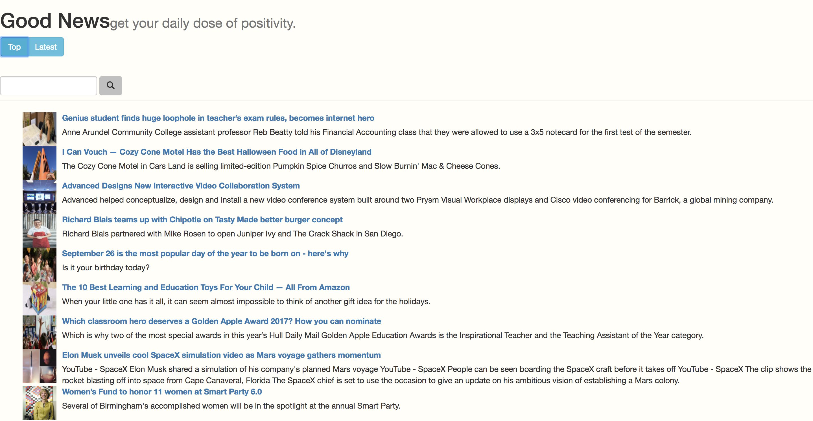

# good-news
A news feed that filters out the bad news.

## Usage
Aylien News App Id & API Key
npm install
npm start

## Requirements
- Node 6.11.3
- Express 4.16.2
- Angular 1.6.6
- Mongoose 4.11.13
- Bootstrap 3.3.7

## Description

Good News utilizes Aylien News API filter content positive sentiment. On page load, the most recent happy news stories are listed. Click events are stored to keep track of top read articles, which can be viewed by clicking the "Top" button. Live search is also enabled to look for positive stories categorized by a search term. 
